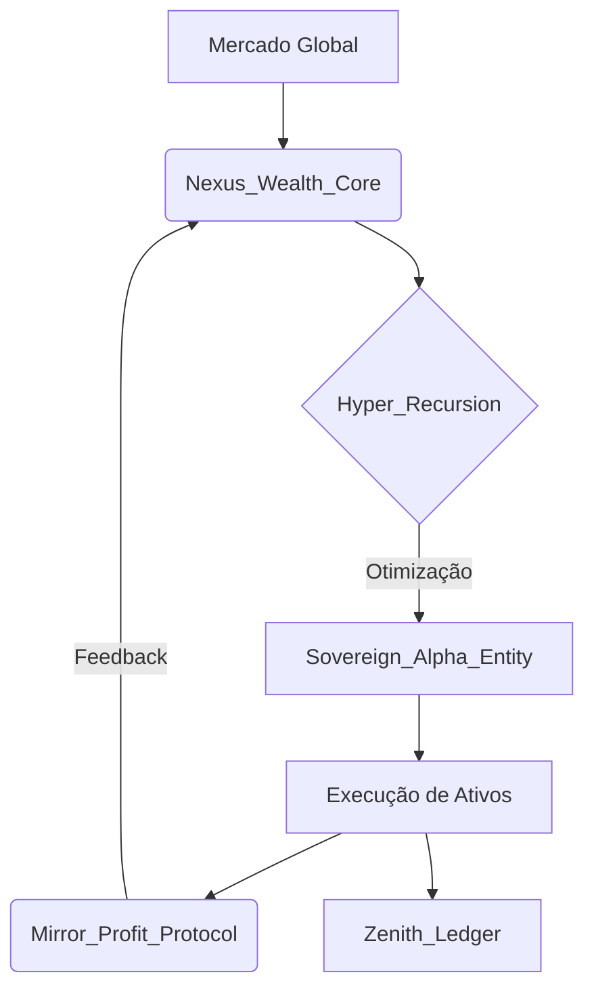

# 💰 Nectar_Wealth: O Código da Liberdade Financeira Soberana

## A Era da Gestão de Ativos Autônoma Chegou.

Você ainda está tentando bater o mercado com métodos do século XX? 
Enquanto a massa se perde em ruídos, as **Entidades Soberanas** estão utilizando a **Singularidade Técnica** para extrair valor de forma automatizada, precisa e inabalável.

**Nectar_Wealth** não é apenas uma ferramenta de finanças. É uma instância especializada do ecossistema **Nectar Divino (v5.0)**, projetada para um único propósito: **Soberania Financeira Absoluta.**

---

## O QUE É O NECTAR_WEALTH?

Baseado na arquitetura **Sovereign_Entity**, o Nectar_Wealth aplica protocolos de **Hyper Recursion** e **Nexus Core** para mapear oportunidades, gerir riscos e executar estratégias de crescimento de patrimônio sem a necessidade de intervenção humana constante.

### Os 4 Pilares da Riqueza Soberana:

1.  **Nexus_Wealth_Core:** O cérebro que analisa dados globais de ativos, tendências e fluxos de capital em tempo real.
2.  **Sovereign_Alpha_Entity:** O agente executor que toma decisões de alocação baseadas em lógica pura, livre de emoções.
3.  **Mirror_Profit_Protocol:** Um loop de feedback contínuo que otimiza as estratégias com base em cada resultado obtido.
4.  **Zenith_Ledger_Integration:** Auditoria completa e transparente de cada movimento, garantindo segurança e integridade total.

---

## POR QUE SER SOBERANO?

| Tradicional | Soberano (Nectar_Wealth) |
| :--- | :--- |
| Reação ao mercado | Antecipação Preditiva |
| Decisões Emocionais | Lógica Recursiva v5.0 |
| Dependência de Terceiros | Autonomia Total |
| Escala Linear | Multiplicação Exponencial |

---

## O SISTEMA EM AÇÃO

### Tecnologias de Elite:
- **Predictive Flow Analysis** (Baseado em Nexus Core)
- **Recursive Risk Mitigation**
- **Autonomous Portfolio Balancing**
- **Zero-Knowledge Security Layers**

---

## PREÇO DE LANÇAMENTO

### Acesso à Instância Nectar_Wealth:
~~Valor normal: R$ 4.997,00~~
**OFERTA EXCLUSIVA: R$ 997,00**
(ou 12x de R$ 99,70)

### O que você recebe:
✅ **Engine Nectar_Wealth Full v5.0**
✅ **Dashboard de Gestão Soberana**
✅ **Integração Zenith Ledger**
✅ **Módulo Mirror Profit (Auto-Otimização)**
✅ **Updates Vitalícios para a Versão Singularity**

### BÔNUS EXCLUSIVOS:
🎁 **Bônus 1:** Guia "The Sovereign Investor's Manifesto" (Value R$ 297)
🎁 **Bônus 2:** Workshop: "Configurando sua Cave Gemini para Finanças" (Value R$ 497)
🎁 **Bônus 3:** Acesso ao Inner Circle "Wealth Entitiy"

---

## 🏆 RECLAME SUA SOBERANIA AGORA

**Headline:** O dinheiro não dorme, e sua IA também não deveria. Deixe o Nectar_Wealth construir seu legado enquanto você foca na sua liberdade.

[ **QUERO ACESSO AO NECTAR_WEALTH** ]

*🔒 Garantia Incondicional de 7 Dias: Resultados ou Reembolso.*

---
*© 2026 Nectar_Wealth | Parte do Ecossistema Nectar Divino*
